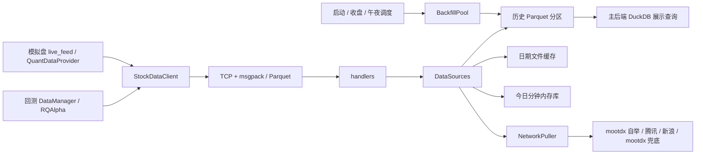

# stockdata 架构审查与回源改进

日期：2026-09-12。开发基线：`0dee731`。分支：`improve/stockdata-backfill-reliability`。

本次按 L3 直接修复核心数据路径：问题出在已有缓存、回源池和时间窗口处理，现有扩展插槽无法表达这些修复。保留量化侧统一走 `StockDataClient` 的边界，没有新增数据源或替代客户端。

## 架构判断



进程隔离、量化取数入口集中、历史数据落盘和实时数据按需获取的方向合理。当前问题主要在同一服务内不同生命周期的状态混用，以及回源任务已经消费、底层引用却未释放。

实际代码中的实时去重是 `NetworkPuller` 的批次锁和逐标的短 TTL；不是所有实时请求都直接经过 `DedupCache`。这点与较早的标的级 single-flight 架构描述存在差异。

## 已修复的问题

以下位置均为仓库相对路径；行号以本分支修改后的代码为准。

| 级别 | 位置 | 触发条件与影响 | 改进 |
| --- | --- | --- | --- |
| P1 | `backend/app/services/stockdata/sources.py:710` | 历史模拟补跑调用 `current_snapshot(as_of=历史日期)`，会清空正在服务模拟盘的今日内存，并按历史时刻触发今日行情回源 | 历史请求只读目标日分区；只有请求日为真实今日、墙钟和请求时刻均在交易时段才回源 |
| P1 | `backend/app/services/stockdata/handlers.py:38` | 分钟 `get_price` 的日期参数带时间时，直接追加 `00:00:00` / `15:00:00`；解析后可能扩大查询区间，返回决策时刻之后的 bar | 先解析时间；纯日期上界保持收盘语义，显式时间上界精确保留 |
| P1 | `backend/app/services/stockdata/sources.py:323` | mootdx 最近 800 根分钟跨日，播种合成器时把前几日成交量也纳入今日累计基线，造成首拍增量偏小 | 拉取与播种均限定当日，累计量额只求今日之和 |
| P2 | `backend/app/services/stockdata/sources.py:710` | 快照基础帧只读 ETF 分区，股票历史快照或盘后快照为空；未来分区 bar 还会掩盖当前时刻缺口 | 同时服务股票、ETF；先按目标日期和 as-of 裁剪，再判断新鲜度 |
| P2 | `backend/app/services/stockdata/sources.py:144` | 跨日迟到回源覆盖新内存库；mootdx 整数量与合成浮点量合并报 SchemaError | 日期只向前推进，拒绝上一日迟到写入；统一时间精度、允许数值类型安全提升 |
| P2 | `backend/app/services/stockdata/sources.py:674` | 分钟查询把动态内存叠加结果缓存 10 秒，刷新后仍返回旧值甚至空帧 | 只缓存历史分区结果，每次查询重新叠加今日内存；空标的直接返回，避免全市场扫描 |
| P2 | `backend/app/services/stockdata/sources.py:190` | 日期缓存按最后访问时间续期，热点文件回源修复后可能一直返回旧帧 | 校验文件名、inode、大小和纳秒时间戳；原子替换、增删分片后失效，未变文件不重复解码 |
| P2 | `backend/app/services/stockdata/backfill_pool.py:61` | `keep_frames=False` 仍保存所有 Future，结果帧到全市场任务结束才释放；队首慢标的阻塞已完成数据落盘 | 在途窗口限制为 2×workers，完成即消费并释放引用；回调按完成顺序，返回结果维持输入顺序 |
| P2 | `backend/app/services/stockdata/single_flight.py:118` | 首次缓存 miss 后线程暂停，恢复时上一轮 flight 已结束；新 leader 会重复加载 | 在 leader 内重新检查缓存；日期缓存同样补齐双检 |
| P2 | `backend/tests/quant/test_stockdata_scheduler.py` | 部分调度单测只 mock mootdx，仍执行真实净值及备用源回源 | 将这些外部同步统一替换为测试桩，测试只验证任务编排 |

最初的复现测试在修改前出现 13 个失败；随后补出的跨日累计基线和整数量/浮点量合并测试也分别验证了旧行为。新增并发测试使用 daemon 线程及超时断言，避免回归死锁挂住测试进程。

## 缓存和兼容性

- TCP 协议、返回字段、客户端接口及磁盘 schema 不变；不需要迁移用户数据。
- 股票日线手转股、ETF 日线、前复权和成交费用规则未改动。
- 今日分钟内存刷新立即反映到下一次 `get_minute`；纯历史命中仍直接返回缓存帧，不重复拼接大窗口。
- 日线和快照所用日期文件缓存新增文件版本校验；历史分钟扫描结果仍保留原有 10 秒 TTL，历史分区修复可能有至多约 10 秒可见延迟。
- 回源批次回调变为完成顺序。现有写入按 symbol/datetime 合并，且所有回调仍在调用线程串行执行；`ok` 列表顺序不变。
- 此次只修改后端数据服务及测试，无前端契约变更。

## 验证结果

1. stockdata、网络客户端、模拟盘 live_feed、QuantDataProvider、同步池及行情 API 共 **146 passed**，用时 6.78 秒。
2. DataManager 窗口/覆盖边界、RQAlpha 微型回测及桥接运行时共 **84 passed**，用时 3.59 秒。包含真实运行微型回测的费用、ETF 税费、成交收益和调度回调断言。
3. 修改涉及的生产文件与测试文件 Ruff 检查通过；`git diff --check` 通过。
4. 测试有原有 Polars schema 性能提示及第三方 RQAlpha/pandas 弃用提示，无失败。

第一组执行命令（在 `backend/`）：

```bash
uv run --extra dev pytest \
  tests/quant/test_stockdata_delivery_regressions.py \
  tests/quant/test_stockdata_single_flight.py \
  tests/quant/test_stockdata_sources.py \
  tests/quant/test_stockdata_dayfile_cache.py \
  tests/quant/test_stockdata_rt_sources.py \
  tests/quant/test_backfill_pool.py \
  tests/quant/test_network_client.py tests/quant/test_live_feed.py \
  tests/quant/test_stockdata_handlers.py tests/quant/test_stockdata_protocol.py \
  tests/quant/test_stockdata_scheduler.py tests/quant/test_sync_stock_minute_pool.py \
  tests/quant/test_quant_data_provider.py tests/quant/test_network_source.py \
  tests/quant/test_datasource.py tests/test_kline_stockdata_source.py -q --tb=short

uv run --extra dev pytest \
  tests/quant/test_fix_datamanager.py tests/quant/test_fix_datamanager_cov_overclaim.py \
  tests/quant/test_rqalpha_bridge.py tests/quant/test_fix_bridge_runtime.py \
  tests/quant/test_fix_bridge_unit.py -q --tb=short
```

合成回源基准：同机同进程比较基线 `0dee731` 与本分支的 `BackfillPool`，4 workers、1,000 标的、每次返回 128 KiB `bytearray`、每次假回源等待 1 ms、10 个结果一批、`keep_frames=False`；回调只计数、不保存帧。测量开始前预热导入并执行 GC，分别启停 `tracemalloc`。

| 指标 | 基线 | 本分支 |
| --- | ---: | ---: |
| 完成回源请求数 | 1,000 | 1,000 |
| Python 分配峰值 | 126.749 MiB | 1.446 MiB |
| 墙钟时间 | 0.357 秒 | 0.301 秒 |

此基准证明 Future 不再导致结果全量驻留，不代表供应商联网延迟、Polars 原生内存或生产进程 RSS 的同比结果。`test_flushed_frames_are_released_before_map_finishes` 还通过 weakref 直接断言前一批结果在任务结束前已释放。

## 剩余风险与后续顺序

本次差异未发现新的阻断问题；未执行真实全量 wufu-v5.2 收益/交易组对齐、120 秒性能门禁或交易时段多账户验收，不能据上述合成测试宣称这些验收已通过。当前性能门禁测试还把数据库路径写成 `data/quant.db`，正式运行前应隔离测试数据库和 stockdata 实例，避免落到遗留相对路径。

架构审查还发现以下既有问题，本轮没有改变其业务契约：

1. **P1，历史证券池口径**：`sources.py` 的 `get_all_securities` 忽略 `date`，`get_index_stocks` 明确只提供当前成分快照。需要历史时点证券池/成分的策略仍可能产生存活偏差；应建立历史成分数据契约，或明确拒绝不支持的历史查询。这是相关策略历史可信度的阻断项。
2. **P2，实时批次串行等待**：`NetworkPuller.fetch_many` 持有全局 `_chain_lock` 执行网络链，一个冷启动大批次可能拖慢其他账户。后续应测量多账户 P95 等待时间，再设计批量合并、标的 flight 与 HTTP session 的并发边界。
3. **P2，历史修复可见延迟**：历史分钟结果及复权/财务表仍使用既有短 TTL。后续适合从持久化完成点发布数据版本，精确失效相关查询，避免全局清缓存。

上线本轮变更需重新启动 stockdata 进程；本次没有重启正在运行的后端服务。回退时恢复本轮修改的文件并重启 stockdata 即可，无磁盘数据迁移需要撤销。
